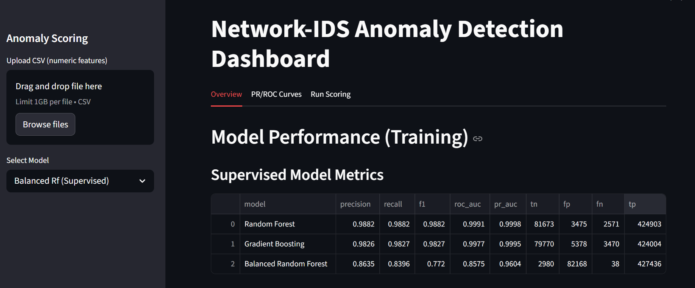

# AI-Based Intrusion Detection System  
## Detecting Evolving and Zero-Day Attacks using Hybrid Machine Learning

---

## Overview

This project implements a hybrid AI-based Network Intrusion Detection System (NIDS) designed to detect both known attacks and previously unseen (zero-day) attack behavior.

Traditional intrusion detection systems rely on static signatures and historical attack patterns. In real-world environments, attackers continuously evolve their techniques, leading to concept drift and reduced model reliability.

This project addresses these challenges by combining supervised machine learning with anomaly detection methods.

---

## Project Objectives

- Detect known network attacks using supervised learning  
- Identify zero-day or previously unseen attacks using anomaly detection  
- Compare performance between supervised and unsupervised models  
- Design a hybrid IDS architecture for improved detection coverage  
- Analyze trade-offs between detection accuracy and false positives  
- Provide an interactive dashboard for monitoring and analysis  

---

## Key Results

### Supervised Models
- Random Forest (Best Performer)  
  - Precision: 0.9882  
  - Recall: 0.9882  
  - ROC-AUC: 0.9991  

### Anomaly Detection (Ensemble)
- Recall: ~0.998  
- Precision: ~0.57  

### Insight
Supervised models provide high accuracy for known attacks, while anomaly detection achieves high recall for unknown threats. A hybrid approach improves overall coverage but introduces false positives.

---

## System Architecture

    CIC-IDS2017 Dataset
            │
            ▼
    Data Preprocessing
            │
    ┌───────┴────────┐
    │                │
    ▼                ▼
Supervised       Anomaly Detection
(Known Attacks)  (Zero-Day Detection)

- Random Forest       - Isolation Forest
- Gradient Boosting   - Local Outlier Factor
- Balanced RF         - One-Class SVM
                      - Autoencoder

        └───────┬────────┘
                ▼
        Hybrid Decision Layer
      (Score Fusion + Thresholding)
                ▼
        Alerts / Dashboard Output

---

## Why This Project Matters

Modern intrusion detection systems struggle in dynamic environments due to:

- Evolving attack patterns (concept drift)  
- Limited labeled data for emerging threats  

This project demonstrates that combining supervised learning with anomaly detection improves detection coverage in practical cybersecurity scenarios.

---

## Dataset

CIC-IDS2017 Dataset (UNB)

The dataset includes realistic network traffic across multiple attack scenarios:

- DoS / DDoS  
- Brute Force  
- Botnet  
- Web Attacks  
- Infiltration  
- Heartbleed  
- Benign traffic  

Note: The dataset is not included in this repository due to size constraints.

---

## Methodology

### Data Preprocessing

- Merged multiple daily CSV files  
- Removed null, infinite, and duplicate values  
- Converted labels to binary (Attack vs Benign)  
- Applied feature scaling using MinMaxScaler  
- Used SMOTE for balancing supervised training data  
- Created separate datasets for supervised and anomaly detection  

### Supervised Models

- Random Forest  
- Gradient Boosting  
- Balanced Random Forest  

### Anomaly Detection Models

- Isolation Forest  
- Local Outlier Factor (LOF)  
- One-Class SVM  
- Autoencoder  

### Hybrid Approach

- Combines supervised predictions with anomaly scores  
- Applies score normalization and thresholding  
- Produces final alerts  

---

## Repository Structure

    NIDS/
    │
    ├── models/
    │   ├── best_gb.pkl
    │   ├── ensemble_minmax_scalers.pkl
    │   ├── isolation_forest.pkl
    │   ├── oneclass_svm.pkl
    │
    ├── outputs/
    │   ├── reports/
    │   ├── plots/
    │   └── metrics/
    │
    ├── src/
    │   ├── preprocessing/
    │   ├── training/
    │   ├── evaluation/
    │   └── dashboard/
    │
    ├── notebooks/
    ├── requirements.txt
    └── README.md

---

## Files Not Included

Due to size and security constraints:

### Models
- best_random_forest.pkl  
- best_balanced_rf.pkl  
- lof_novelty.pkl  

### Data
- CIC-IDS2017 dataset  

### Environment
- .env file  

---

## Setup Instructions

### Clone Repository
    git clone https://github.com/your-username/NIDS.git
    cd NIDS

### Create Virtual Environment
    python -m venv .venv

### Activate Environment

Windows:
    .venv\Scripts\activate

macOS/Linux:
    source .venv/bin/activate

### Install Dependencies
    pip install -r requirements.txt

### Run Pipeline
    python src/preprocessing/preprocess.py
    python src/training/train_supervised.py
    python src/training/train_anomaly.py
    python src/evaluation/evaluate_models.py

### Run Dashboard
    streamlit run src/dashboard/app.py

---

## Dashboard

The dashboard provides:

- Model performance comparison  
- ROC and PR curve visualization  
- Anomaly detection insights  
- Threshold tuning  
- Interactive exploration of results

## Project Demonstration

### Dashboard Interface

### Model Performance

---

## How to Use

1. Upload a CSV file with network flow features  
2. Select a model (Supervised or Anomaly)  
3. View predictions and evaluation metrics  

---

## Key Insights

- Supervised models perform well on known attacks but struggle with unseen patterns  
- Anomaly detection provides high recall but introduces false positives  
- A hybrid IDS improves coverage but requires careful tuning  

---

## Limitations

- High false positive rate in anomaly detection  
- Evaluation limited to offline dataset  
- No automated concept drift handling  
- Limited explainability integration  
- Increased computational complexity  

---

## Future Work

- Real-time streaming IDS using Kafka or Spark  
- Concept drift detection and automated retraining  
- Deep learning-based anomaly detection  
- Explainable AI integration (SHAP, LIME)  
- Integration with SIEM systems

## Real-World Impact

This system can help security analysts detect both known and unknown threats in dynamic environments. It demonstrates how hybrid machine learning approaches improve detection coverage compared to traditional IDS systems.

---

## Author

Tanishka Ganesh Mali  
M.S. Cybersecurity  
Pennsylvania State University
